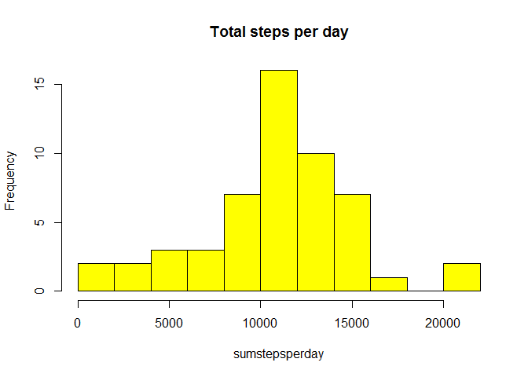
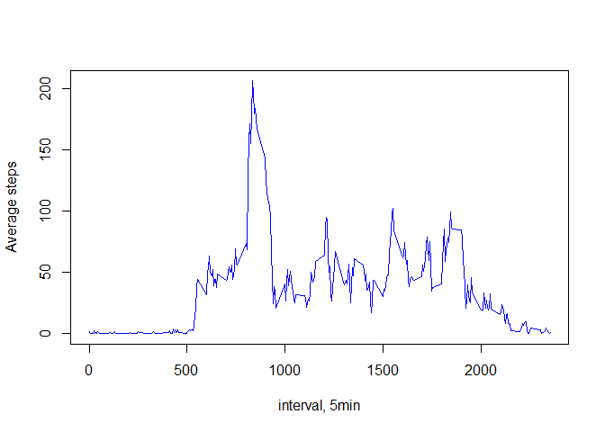
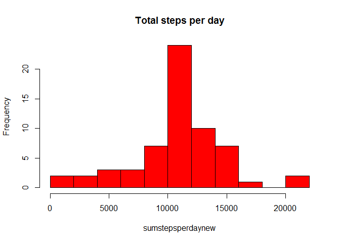

# Reproducible Research: Peer Assessment 1


## Loading and preprocessing the data

```r
AMDdata<-read.csv(file="activity.csv")
```
## Calculating the total steps for each day

```r
sumstepsperday<-tapply(AMDdata$steps,AMDdata$date,sum)
hist(sumstepsperday, main="Total steps per day", col="yellow",breaks = 10)
```

<!-- -->

## What is mean total number of steps taken per day?

```r
meanstepsperday<-mean(sumstepsperday, na.rm=TRUE)
medianstepsperday<-median(sumstepsperday, na.rm=TRUE)
```
The mean is 10766.19, and the median is 10765

## What is the average daily activity pattern?

```r
meanstepsinterval<-tapply(AMDdata$steps,AMDdata$interval,mean, na.rm=TRUE, simplify = TRUE)
meanstepsinterval<-as.data.frame(as.matrix(meanstepsinterval))
plot(row.names(meanstepsinterval),meanstepsinterval$V1, type="l", xlab="interval, 5min", ylab="Average steps", col="blue")
```

<!-- -->

```r
intervalwithmaxsteps<-row.names(meanstepsinterval)[which.max(meanstepsinterval$V1)]
```
Interval 835, on average across all the days in the dataset, contains the maximum number of steps

## Imputing missing values

```r
narow<-nrow(AMDdata[is.na(AMDdata$steps),])
```
There are 2304 missing values

#Strategy: replace the NA with averge steps for each interval

```r
cleanAMDdata<-AMDdata
meanstepsinterval[,"interval"]<-rownames(meanstepsinterval)
cleanAMDdata<-merge(cleanAMDdata,meanstepsinterval,by="interval")
cleanAMDdata$steps[is.na(cleanAMDdata$steps)]<-cleanAMDdata$V1[is.na(cleanAMDdata$steps)]
```

##Calculate the total number steps, mean and median for each day 

```r
sumstepsperdaynew<-tapply(cleanAMDdata$steps,cleanAMDdata$date,sum)
hist(sumstepsperdaynew, main="Total steps per day", col="red",breaks = 10)
```

<!-- -->

## What is mean total number of steps taken per day?

```r
meanstepsperdaynew<-mean(sumstepsperdaynew, na.rm=TRUE)
medianstepsperdaynew<-median(sumstepsperdaynew, na.rm=TRUE)
```
The mean is 10766.19, and the median is 10766.19


##meanstepsperdaynew<-tapply(cleanAMDdata$steps,cleanAMDdata$date,mean)
##medianstepsperdaynew<-tapply(cleanAMDdata$steps,cleanAMDdata$date,median)


## Are there differences in activity patterns between weekdays and weekends?


## need to be commited at least once
